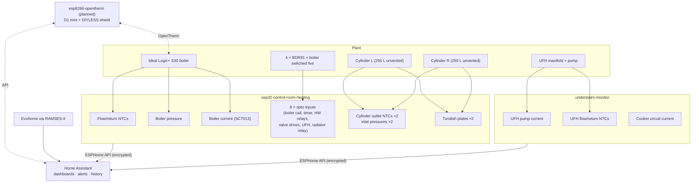

# Heating Plant Monitoring: Boiler, Cylinders and Safety Devices on ESPHome (WIP)

**Instrumenting a domestic heating plant the way a BMS instruments a plant room. Two ESP32-S3 boards running ESPHome monitor the boiler's flow/return temperatures, system pressure, electrical load and operating state; the boiler call, hot-water timer and cylinder stat signals alongside the Evohome relay states; both unvented hot-water cylinders (outlet temperatures, inlet pressures, tundish discharge); and the underfloor heating plant. A planned OpenTherm stage moves the boiler to modulating, PID-trimmed flow-temperature control, with Evohome as an input rather than the controller.**

> **The short version:** a plant-room points list built from scratch:
> - **temperatures** (NTC dividers)
> - **pressures** (0.5-4.5 V transducers through 10k/20k dividers)
> - **current** (SCT013 clamp with a bias network) combined with the **flow temperature** and the wired boiler call into boiler states v3: burner lighting, burning at low/mid/high fire, anti-cycle wait, pump overrun, plus a "firing without call" alarm
> - **demand** (230 V opto-isolated boiler switched live, timer output, hot-water relays, valve drives, UFH and radiator relays)
> - **leak detection** (pulsed tundish plates)
>
> **Built so far:** both boards' firmware; boiler flow/return, system pressure (calibrated, filtered), current and **v3 states (validated against video of the boiler display)**; the **opto board, installed and commissioned** (all 8 demand inputs proven); both cylinders' outlet temperatures and inlet pressures (live, left/right verified), a per-cylinder "hot water available" estimate, and both tundish sensors (water-tested); the opto enclosure (logic side); an off-board rewiring of the control-room board ([full schematic](docs/12-control-room-wiring-schematic.md)); and a 23-rule alerts package ([doc 15](docs/15-alerts.md)).
>
> **Latest (16-18 Nov):** **boiler states v3 live**: two videos of the boiler display showed v2 was reading the boiler back to front (at low fire the pump alone draws more than burning); v3 uses the flow temperature to decide burning ([doc 16](docs/16-boiler-states-short-cycling-and-v3.md)). **Opto board commissioned** at the junction box rewire; clamp on 2 turns. **Inlet height gap closed** (5.87 m, mains sensor calibrated, the daytime gap was the inlet check valves holding peaks: [doc 17](docs/17-cylinder-inlets-height-offset-tests-and-trend.md)). 10 µF on every pressure input (one using a GPIO held low as its ground). Pressure peak alert and a cold minimum that ignores pump starts.
>
> **Earlier (12-16 Nov):** boiler gauge commissioned on GPIO6; inlet spans verified (tyre gauge, left gain 1.028); left inlet noise cured with 10 µF at the ADC pin; hot water estimate v4; the clamp's boiler states found **wrong at low fire** (flow temperature is the burner signal: v3 designed, [doc 16](docs/16-boiler-states-short-cycling-and-v3.md)); inlet height offset, the vessel pre-charge question and an overnight floor-trend alert ([doc 17](docs/17-cylinder-inlets-height-offset-tests-and-trend.md)); weekly 60 °C check moved to the hubs' own probes (both hubs now 60 °C).
>
> **In progress:** the junction box tidy (Stage 1b), short cycling (automatic bypass: plumber), UFH pump mode and mixing temperature trials, slow-leak diagnosis.
>
> **Then:** OpenTherm with a DIYLESS shield and PID logic.

**Portfolio position:** Stage 2.5 · Heating instrumentation and protocol integration. Feeds #4 optimum start, #5 energy, #6 alarms and #8 PID. Related: [Evohome controls & RAMSES-II](https://github.com/the-control-cabinet/evohome-heating-controls-ramses-integration) · [Mains water metering](https://github.com/the-control-cabinet/mains-water-metering-modbus-rtu) · [HA integration schedule](https://github.com/the-control-cabinet/home-assistant-integration-schedule)

---

## Status at a glance

| Area | Status |
|---|---|
| ESPHome firmware: control room + understairs | ✅ Both written and flashed |
| Control-room wiring | ✅ Off-board rework (gauge boxes, bus strip, posts, clamp strip): [schematic](docs/12-control-room-wiring-schematic.md) |
| Boiler pressure transducer | ✅ On GPIO6 (gauge box, screened backhaul), checked cold and hot against the dial · ✅ 10 µF at the pin (GPIO7 held low as its ground) · ✅ peak alert, cold minimum ignores pump starts |
| Boiler flow/return NTCs | ✅ Installed, meter-checked (11 Nov) |
| Boiler current clamp + states | ✅ 2 turns, ±3% vs meter · ✅ **v3 live** (flow temperature + clamp + IN1), validated against video ([doc 16](docs/16-boiler-states-short-cycling-and-v3.md)) |
| Opto board (8 inputs, own enclosure) | ✅ **Installed and commissioned 17 Nov**: all 8 inputs proven on and off ([doc 11](docs/11-opto-board-installation.md#6-installed-and-commissioned-17-nov-2026)) |
| Cylinder hot-outlet NTCs ×2 | ✅ Fitted, meter-checked, left/right verified · "hot water available" v3 with per-cylinder draw capture ([doc 14](docs/14-hot-water-stratification.md)) |
| Cylinder inlet pressures ×2 | ✅ Live, spans verified, 10 µF on both, expected pressure from the 5.87 m height (gap explained: check-valve ratchet), overnight floor trend ([doc 17](docs/17-cylinder-inlets-height-offset-tests-and-trend.md)) |
| Expansion vessels | ✅ Replaced 11 Nov (24 L, 3.5 bar), peak 3.8 bar on reheat · ⏳ pressure reducing valves settle ~2.5 bar ([doc 05](docs/05-dhw-cylinders-expansion-and-tundish.md#plumber-visit-and-commissioning-11-nov-2026)) |
| Tundish sensors ×2 | ✅ Commissioned, water-tested (naming confirmed), no wet events with the new vessels |
| Alerts | ✅ Package live ([doc 15](docs/15-alerts.md)); opto alerts on; starts/firing/failed ignitions from v3; "boiler called, flow cold" on IN1; pressure peak; inlet floor trend |
| Understairs board: UFH pump + cooker clamps, UFH flow/return, (proposed) manifold pressure | ✅ Flashed · ⏳ sensors to connect |
| OpenTherm + PID | 📐 Designed in its own repo: [opentherm-boiler-control-esphome](https://github.com/the-control-cabinet/opentherm-boiler-control-esphome) · node hardware assembled |

Full tracker: [docs/08](docs/08-commissioning-tracker.md)

## Findings so far

| Finding | How it was found | Doc |
|---|---|---|
| **NTC noise was a 330 kΩ resistor** (should be 3.3 kΩ) | A powered voltage test on each divider | [02](docs/02-signal-conditioning-and-noise.md) |
| **Clamp cable screen joined to its white core**, shorting the new bias node | Bias read 0 V after the rework | [13](docs/13-off-board-wiring.md) |
| **Short cycling without a bypass**: 37 starts by mid-afternoon on a UFH-only day | Current-clamp states + flow/return | [Evohome A6](https://github.com/the-control-cabinet/evohome-heating-controls-ramses-integration/blob/main/docs/A6-pump-overrun-and-bypass.md) |
| **Weeping relief valve** from failed expansion vessels, then **fix confirmed** (new vessels: knee at 3.5 bar, 3.8 bar peak, no tundish events) | Tundish plates + inlet gauges | [05](docs/05-dhw-cylinders-expansion-and-tundish.md) |
| **A false 5 bar** from a pulled-out divider leg | Pin voltage exactly 1.5× its neighbour (the divider ratio) | [05](docs/05-dhw-cylinders-expansion-and-tundish.md#plumber-visit-and-commissioning-11-nov-2026) |
| **Both pressure reducing valves settle at ~2.5 bar** although marked 3.5 bar, with mains at ~2.9 bar | Inlet gauges + the mains flow meter at 18:31 | [05](docs/05-dhw-cylinders-expansion-and-tundish.md#plumber-visit-and-commissioning-11-nov-2026) |
| **Left/right swapped** on the inlet gauges and the outlet NTCs | A kitchen draw dipped one inlet and warmed the "other" outlet | [12](docs/12-control-room-wiring-schematic.md) |
| **The outlet NTC lags at rest**; per-cylinder draw capture fixes the estimate | Draw tests on each side | [14](docs/14-hot-water-stratification.md) |
| **The low CS92 pocket is adequate** (tops ~56-58 °C after reheats); legionella setpoint decision open | Captured tops vs probes | [14](docs/14-hot-water-stratification.md#is-the-low-probe-pocket-right-summary) |
| **`relay_demand` isn't a hot water on/off signal**; `heat_demand` is | False alerts mid-reheat | [15](docs/15-alerts.md) |
| **The clamp reads low-fire burning as "off"** (0.13-0.18 A) and the pump overrun as "firing" (0.30-0.40 A) | Flow-temperature burn detector vs clamp, 13-15 Nov | [16](docs/16-boiler-states-short-cycling-and-v3.md) |
| **Short cycling with radiators only**: ~50 s burns every ~2.6 min | Flow-confirmed, 15 Nov early morning | [16](docs/16-boiler-states-short-cycling-and-v3.md) |
| **Inlet noise needs filtering at the ADC pin**: the meter read steady while the ADC jumped | Pin swap + meter at each point; 10 µF at IO1 | [17](docs/17-cylinder-inlets-height-offset-tests-and-trend.md) |
| **v2 boiler states were inverted**: its "firing low" was the pump alone, its "ignition attempts" were the burner going out | Two videos of the boiler display aligned with the history | [16](docs/16-boiler-states-short-cycling-and-v3.md) |
| **The boiler cuts out at 72-73 °C and waits a fixed ~120 s** before relighting; radiators alone give 19 burns an hour | Video + v3 replay, 17-18 Nov | [16](docs/16-boiler-states-short-cycling-and-v3.md) |
| **Adding clamp turns moved pump-only onto a threshold** (0.35 → 0.38 A) and caused false light-offs | Next morning's replay | [16](docs/16-boiler-states-short-cycling-and-v3.md) |
| **The inlet "height gap" was the check valves holding peaks**, not a sensor error | Overnight mains − inlet = 0.55-0.58 bar = the 5.87 m height | [17](docs/17-cylinder-inlets-height-offset-tests-and-trend.md) |
| **A pump start dips the boiler pressure ~0.1 bar for ~14 min**, enough to fake a leak signal | Cold minimum read 0.99 then 0.0; fixed by counting only while the boiler is off | [04](docs/04-pressure-and-leak-diagnosis.md) |
| **A 3.5 bar vessel pre-charge on a ~2.5 bar supply** leaves the first part of expansion uncushioned (3.7-4.1 bar peaks) | Boyle's law vs measured peaks | [17](docs/17-cylinder-inlets-height-offset-tests-and-trend.md) |

## Architecture

```mermaid
flowchart TB
    subgraph PLANT["Plant"]
        B["Ideal Logic+ S30 boiler"]
        C1["Cylinder L (250 L unvented)"]
        C2["Cylinder R (250 L unvented)"]
        UFH["UFH manifold + pump"]
        BDR["4 × BDR91 + boiler switched live"]
    end
    subgraph CR["esp32-control-room-heating"]
        T["Flow/return NTCs"]
        P["Boiler pressure"]
        I["Boiler current (SCT013)"]
        O["8 × opto inputs<br/>(boiler call, timer, HW relays,<br/>valve drives, UFH, radiator relay)"]
        DH["Cylinder outlet NTCs ×2<br/>inlet pressures ×2"]
        TD["Tundish plates ×2"]
    end
    subgraph US["understairs-monitor"]
        UP["UFH pump current"]
        UT["UFH flow/return NTCs"]
        CK["Cooker circuit current"]
    end
    B --> T & P & I
    BDR --> O
    C1 & C2 --> DH & TD
    UFH --> UP & UT
    CR & US -->|"ESPHome API (encrypted)"| HA["Home Assistant<br/>dashboards · alerts · history"]
    OT["esp8266-opentherm (planned)<br/>D1 mini + DIYLESS shield"] <-.->|"OpenTherm"| B
    OT <-.->|"API"| HA
    EVO["Evohome via RAMSES-II"] --> HA
```

## Points list

| # | Point | Board / GPIO | Type | Range / scaling | Status |
|---|---|---|---|---|---|
| 1 | Boiler flow temperature | CR GPIO4 | AI | NTC 10k B3977 | ✅ Installed, meter-checked |
| 2 | Boiler return temperature | CR GPIO5 | AI | NTC 10k B3977 | ✅ Installed, meter-checked |
| 3 | Boiler ΔT | derived | Calc | Flow − return | ✅ Live |
| 4 | Boiler system pressure | CR GPIO6 | AI | 0-80 psi, 0.5-4.5 V, ÷0.667 (in the gauge box) | ✅ Calibrated · moving to GPIO6 |
| 5 | Boiler supply current | CR GPIO3 | AI | SCT013-015, 15 A/V | ✅ Live |
| 6 | Boiler electrical state | derived | Multi-state | Current bands + demand | ✅ Live (Overrun/Pre-Purge need IN1) |
| 7 | Firing without call | derived | Alarm | State vs demand | With #5 and #8 |
| 8 | Boiler call (switched-live joint) | CR GPIO14 | DI | Opto, 230 V | Logic side ✅ · mains at rewire |
| 9 | Hot water enabled (timer output) | CR GPIO18 | DI | Opto | Logic side ✅ · mains at rewire |
| 10 | HW relay L output (IN3) | CR GPIO15 | DI | Opto | To install |
| 11 | HW relay R output (IN4) | CR GPIO16 | DI | Opto | To install |
| 12 | IN5-IN8: cylinder valve drives, UFH relay, radiator relay (after bypass) | CR GPIO17 / 11 / 12 / 42 | DI | Opto | Logic side ✅ · mains at rewire |
| 13 | Cylinder L hot-outlet temperature | CR GPIO9 | AI | NTC (strap-on, lagged) | ✅ Live · left/right verified |
| 14 | Cylinder R hot-outlet temperature | CR GPIO8 | AI | NTC (strap-on, lagged) | ✅ Live · left/right verified |
| 15 | Cylinder L inlet pressure | CR GPIO1 | AI | 0-150 psi (10.34 bar) | ✅ Live, alerts on · ⏳ tyre-gauge span |
| 16 | Cylinder R inlet pressure | CR GPIO2 | AI | 0-150 psi | ✅ Live, alerts on · ⏳ tyre-gauge span |
| 17-18 | Tundish L / R wet + running | CR GPIO39 / 20 | DI | Pulsed plates, 2N7000 | ✅ Live |
| 19 | Tundish events | derived | Counter | Persistent | ✅ Live |
| 20 | UFH pump current / running | US GPIO10 | AI + derived | SCT013-005 (> 0.10 A = running) | Firmware ✅, clamp to fit |
| 21-22 | UFH flow / return (mixed side) + ΔT | US GPIO4 / 5 | AI | NTC | Firmware ✅, placement to decide |
| 23 | Cooker circuit current / on | US GPIO2 | AI + derived | SCT013-030 (> 1.0 A = on) | Firmware ✅, clamp to fit |
| 24 | UFH manifold pressure | US GPIO1* | AI | 0-5 bar | 📐 Proposed (leak isolation) |
| 25 | UFH zone heat demand ×6 | via RAMSES-II | Network | From the HCC80R | ✅ Live (Evohome repo) |
| 26 | Board health (online, Wi-Fi, uptime) | both | Diagnostic | | Live |
| 27-28 | Hot water available L / R | derived | Calc | Top used (live or captured after each cylinder's own draw) + bottom probe, cold feed helper ([doc 14](docs/14-hot-water-stratification.md)) | ✅ Live (v3) |
| 29 | Control-room ESP32 chip temperature | CR internal | Diagnostic | °C | ✅ Live (alert > 75 °C) |
| 30 | Alerts | derived | Alarm | 23 automations, 3 commissioning gates ([doc 15](docs/15-alerts.md)) | ✅ Live |

As built 11 Nov 2026: [doc 12](docs/12-control-room-wiring-schematic.md). CSV: [data/io-schedule.csv](data/io-schedule.csv)

## Key design points

- **Signal conditioning ([docs/02](docs/02-signal-conditioning-and-noise.md)):**
  - NTC dividers from 3V3
  - **10k/20k dividers** bring the 5 V sensors down to ≤3.0 V at the ADC
  - SCT013 clamps on a **1.65 V bias** with a 10 µF coupling capacitor, so both half-cycles stay in range
  - **ADC1 only** for analogue signals, since ADC2 is unusable with Wi-Fi on
- **NTC noise fix:** 100 nF at each ADC pin, twisted/shielded leads away from mains, `samples: 16` + median + moving average, decoupled 3V3, and probes lagged in.
- **Boiler current ([docs/03](docs/03-boiler-current-and-states.md)):** clamp on the **permanent live**, with 3-5 turns for resolution. States are banded from current plus the demand input. Thresholds are set from a week of real data.
- **Slow leak ([docs/04](docs/04-pressure-and-leak-diagnosis.md)):** compare pressure at the same cold condition daily, compute the decay rate, then isolate circuits one at a time. The boiler pressure relief valve discharge, auto air vents and joints are checked; the boiler's expansion vessel is already ruled out.
- **Cylinders and tundishes ([docs/05](docs/05-dhw-cylinders-expansion-and-tundish.md)):** the inlet pressure trace reveals expansion-vessel health (a fast rise to the pre-charge, then a "knee" where the vessel takes over). Gauges sit between the pressure reducing valve and the vessel, so they read the cylinder. Tundish plates are pulsed (150 ms every 5 s) to limit electrolysis, debounced, and counted.
- **Hot water available ([docs/14](docs/14-hot-water-stratification.md)):** 0.4 × top + 0.6 × bottom, in litres at 40 °C. The top NTC lags at rest, so each cylinder detects its **own** draws from its outlet cooling and captures the top then; negative stratification is recognised as an artefact.
- **Alerts ([docs/15](docs/15-alerts.md)):** one HA package; inputs not yet commissioned sit behind gates so they can't false-alarm; several alerts are FDD rules running live.
- **Demand monitoring ([docs/06](docs/06-demand-monitoring-opto.md), [docs/11](docs/11-opto-board-installation.md)):** 230 V opto-isolation of the boiler switched live, the timer output and both cylinders' stat-passing points; relay states come from RAMSES-II.
- **Understairs UFH plant ([docs/10](docs/10-understairs-ufh-and-circuits.md)):** the UFH pump and cooker clamps at the consumer unit, mixed-side flow/return ΔT, HCC80R zone demand via RAMSES-II, and a proposed manifold pressure sensor for split-system leak testing. The firmware is flashed, and a no-sensors-attached test showed floating inputs producing plausible values, a useful lesson.
- **OpenTherm plan ([docs/07](docs/07-opentherm-and-pid-plan.md)):**
  - DIYLESS shield as the OpenTherm master, on its **own ESP8266 D1 mini node** (control kept separate from monitoring)
  - weather compensation + RAMSES-II demand trim + PID with anti-windup and minimum on/off times
  - DHW priority
  - an **interlocked relay changeover** back to Evohome control (force-guided contacts)

## Configuration files

| File | Content |
|---|---|
| [`config/esphome/esp32-control-room-heating.yaml`](config/esphome/esp32-control-room-heating.yaml) | Current control-room firmware: NTCs, pressure, clamp + state machine, opto inputs, tundishes |
| [`config/esphome/esp32-control-room-heating-proposed.yaml`](config/esphome/esp32-control-room-heating-proposed.yaml) | Proposed: 10k/20k dividers, noise filters, cylinder NTCs and pressures, opto pin moves |
| [`config/esphome/understairs-monitor.yaml`](config/esphome/understairs-monitor.yaml) | UFH pump and cooker clamps, UFH manifold NTCs |
| [`config/homeassistant/packages/heating_plant_alerts.yaml`](config/homeassistant/packages/heating_plant_alerts.yaml) | Alerts package: commissioning gates, derived sensors, robust cold minimum, IN1 no-heat check, digest ([doc 15](docs/15-alerts.md)) |
| [`config/homeassistant/packages/dhw_hot_water_available.yaml`](config/homeassistant/packages/dhw_hot_water_available.yaml) | Hot water available v4: top used = max(outlet, bottom probe), usable 42-45 °C ramp ([doc 14](docs/14-hot-water-stratification.md)) |
| [`config/homeassistant/packages/cylinder_inlet_head.yaml`](config/homeassistant/packages/cylinder_inlet_head.yaml) | Expected pressure at the cylinders and each side's deviation ([doc 17](docs/17-cylinder-inlets-height-offset-tests-and-trend.md)) |
| [`config/homeassistant/packages/cylinder_inlet_floor_trend.yaml`](config/homeassistant/packages/cylinder_inlet_floor_trend.yaml) | Overnight inlet floor per side and a drift alert ([doc 17](docs/17-cylinder-inlets-height-offset-tests-and-trend.md)) |
| [`config/homeassistant/packages/boiler_kpis.yaml`](config/homeassistant/packages/boiler_kpis.yaml) | Starts and firing time today, from boiler state v3's Burner On ([doc 16](docs/16-boiler-states-short-cycling-and-v3.md)) |
| [`config/homeassistant/packages/boiler_pressure_peak.yaml`](config/homeassistant/packages/boiler_pressure_peak.yaml) | Daily boiler pressure peak, 14-day history and a threshold message ([doc 04](docs/04-pressure-and-leak-diagnosis.md)) |
| [`config/homeassistant/dashboards/`](config/homeassistant/dashboards/) | Boiler plant card (with the cylinders), boiler state v3 + relays-vs-optos card, hot water card (v4) and cylinder inlet card |
| [`hardware/gauge-box/`](hardware/gauge-box/) | Printed gauge boxes (boiler and cylinder bases, lid, OpenSCAD source) |
| [`config/homeassistant/pressure-statistics.example.yaml`](config/homeassistant/pressure-statistics.example.yaml) | Noise floor (1 h std dev), mean, 7-day change |

All credentials are `!secret` references.

## Documents

| Doc | Covers |
|---|---|
| [01 Hardware and I/O schedule](docs/01-hardware-and-io-schedule.md) | Boards, pin rules, current vs proposed allocation, sensors |
| [02 Signal conditioning and noise](docs/02-signal-conditioning-and-noise.md) | Circuits, NTC noise fixes, calibration |
| [03 Boiler current and states](docs/03-boiler-current-and-states.md) | Clamp placement, turns, state banding, commissioning |
| [04 Pressure and leak diagnosis](docs/04-pressure-and-leak-diagnosis.md) | In-place zero/span (no draining), baseline stats, noise, leak-finding plan |
| [05 DHW cylinders, expansion and tundish](docs/05-dhw-cylinders-expansion-and-tundish.md) | Outlet temperatures, inlet pressures, plumber work, tundish sensors |
| [06 Demand monitoring (opto)](docs/06-demand-monitoring-opto.md) | BDR91 and switched-live inputs |
| [07 OpenTherm and PID: summary](docs/07-opentherm-and-pid-plan.md) | Summary, roadmap and link to the control repo |
| [08 Commissioning tracker](docs/08-commissioning-tracker.md) | Item-by-item status |
| [09 Safety](docs/09-safety.md) | Mains, gas, unvented cylinders, pressure fittings |
| [11 Opto board installation](docs/11-opto-board-installation.md) | Tap points from the junction box survey, enclosure, wiring, commissioning tests |
| [12 Control-room wiring schematic](docs/12-control-room-wiring-schematic.md) | Full as-built drawing, pin table, power-up checks |
| [13 Off-board wiring](docs/13-off-board-wiring.md) | Gauge boxes, bus strip, posts, clamp strip and the screen fault |
| [14 Stratification and hot water available](docs/14-hot-water-stratification.md) | Top/bottom temperatures, estimate v3 (per-cylinder draw capture), probe position, Centre Store settings |
| [15 Alerts](docs/15-alerts.md) | The alerts package: switches, 23 alerts, FDD mapping, commissioning lessons |
| [16 Boiler states, short cycling and v3](docs/16-boiler-states-short-cycling-and-v3.md) | What the clamp can and can't tell, the flow-temperature burn detector, short cycling, v3 design |
| [17 Cylinder inlets: offset, tests, trend](docs/17-cylinder-inlets-height-offset-tests-and-trend.md) | Height offset, vessel pre-charge, kick tests and Test 1, inlet group losses, overnight floor trend |
| [10 Understairs: UFH plant and circuits](docs/10-understairs-ufh-and-circuits.md) | UFH pump and cooker clamps, UFH temperatures and placement, HCC80R data via RAMSES-II, manifold pressure for leak isolation, floating-input lesson |

## Skills demonstrated

| Skill | Evidence |
|---|---|
| Plant-room points list | 30 points across AI, DI, derived, network, diagnostic and alarm types |
| Analogue signal conditioning | NTC dividers, 5 V→3.3 V dividers, CT bias and coupling, filtering |
| Current-based plant state detection | Boiler state machine from load current + demand |
| Pressure diagnostics | Leak decay-rate method; expansion-vessel health from inlet pressure |
| Life-safety-adjacent monitoring | Tundish discharge detection; unvented-cylinder safety checks; a weeping relief valve detected, then the fix confirmed |
| Commissioning | Point-to-point verification (left/right swaps found by a draw test); plausibility (a false 5 bar traced to a divider leg); span checks |
| Alarm management | 23 alerts with commissioning gates, persistence and FDD mapping; false alarms traced to the wrong input and corrected |
| Isolation and segregation | 230 V opto inputs; mains vs low-voltage separation |
| Controls design | OpenTherm master with PID, weather compensation, fail-safe interlock |

📺 [The Control Cabinet on YouTube](https://www.youtube.com/channel/UC5Cupmz7vlfcodpCX7k8iuQ)

*Built and documented by James · part of [The Control Cabinet BMS portfolio](https://github.com/the-control-cabinet). MIT Licence.*
